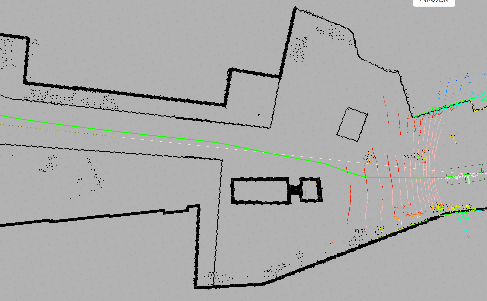

# KPI Analysis Report

## Methodology

### 1. Introduction
The objective is to ensure that the system can compute an optimal path between two points, considering robot kinematics and mapped obstacles, with a success rate of at least 90% and a computation time of less than 250 milliseconds per request. 

This test was conducted within a ROS Noetic environment utilizing Move Base Flex (MBF) as the navigation framework using Global Planner plugin. The purpose of the evaluation is to validate the system’s ability to meet the defined KPI under realistic conditions within the target environment.

### 2. Environment Setup
- **Operating System:** Ubuntu 20.04  
- **ROS Version:** Noetic  
- **Navigation Framework:** Move Base Flex (MBF)  
- **Planner Plugin:** Global Planner

### 3. Procedure
1. Select five distinct goal locations on the map to represent diverse path planning challenges (e.g., open space, narrow corridor, obstacle-dense area).
2. Move loader to the first pose.
3. Execute GoTo Action Server considering the experiment configuration.
4. Verify if the data was recorded in the bag file.
5. Move the robot to the next position or end the experiment.

### 4. Mathematical Formulas
1. Mean ($$\mu$$)

$$\mu = \frac{1}{n} \sum_{i=1}^{n} x_i$$

where $x_i$ is the $i^{th}$ data point, $$n$$ is the total number of data points, and $$\mu$$ is the arithmetic mean.

2. Standard Deviation (Sample) ($$\sigma$$)

$$\sigma = \sqrt{\frac{1}{n-1} \sum_{i=1}^{n} (x_i - \mu)^2}$$

---
## Data Collection

### 1. Data Sources
Two ROS topics are extracted from the recorded bag:

- **Planned Path**: Published by the global planner of Move Base Flex on `move_base_flex/GlobalPlanner/plan`, containing a `nav_msgs/Path` message.
- **Time Elapsed**: Published by GoTo Action which uses the `mbf_msgs/GetPath` service. It sent path requests with predefined start and goal `PoseStamped` messages. This topic publish the time between service request and publication by global planner.

### 2. Collection Process

Record the data to a bag file for post-processing and KPI evaluation.

---
## Results

  

| Pose      | Mean (ms) | Standard Deviation | Criteria | Evaluation |
|-----------|-----------|--------------------|----------|------------|
| Pose A    |     99    | 12.1               | 250      | ✅         |

  

| Pose      | Mean (ms) | Standard Deviation | Criteria | Evaluation |
|-----------|-----------|--------------------|----------|------------|
| Pose B    |     91    | 29.4               | 250      | ✅         |

  

| Pose      | Mean (ms) | Standard Deviation | Criteria | Evaluation |
|-----------|-----------|--------------------|----------|------------|
| Pose C    |     93    | 18.8               | 250      | ✅         |

  

| Pose      | Mean (ms) | Standard Deviation | Criteria | Evaluation |
|-----------|-----------|--------------------|----------|------------|
| Pose D    |     110    | 16.4               | 250      | ✅         |

  

| Pose      | Mean (ms) | Standard Deviation | Criteria | Evaluation |
|-----------|-----------|--------------------|----------|------------|
| Pose E    |     117    | 31.6               | 250      | ✅         |

---
## Conclusion
The global path planning system using MBF and Global Planner successfully meets the stated KPI. The infrastructure is robust enough to support real-time navigation tasks under operational constraints. Continuous monitoring and parameter optimization are recommended for sustained performance in dynamic environments.

---
import DocCardList from '@theme/DocCardList';

<DocCardList />
